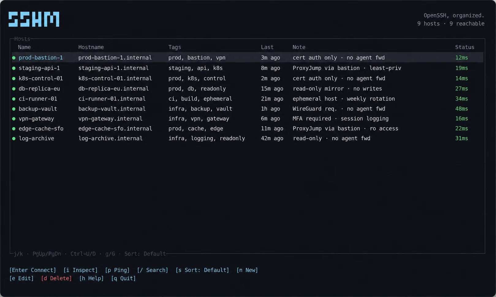
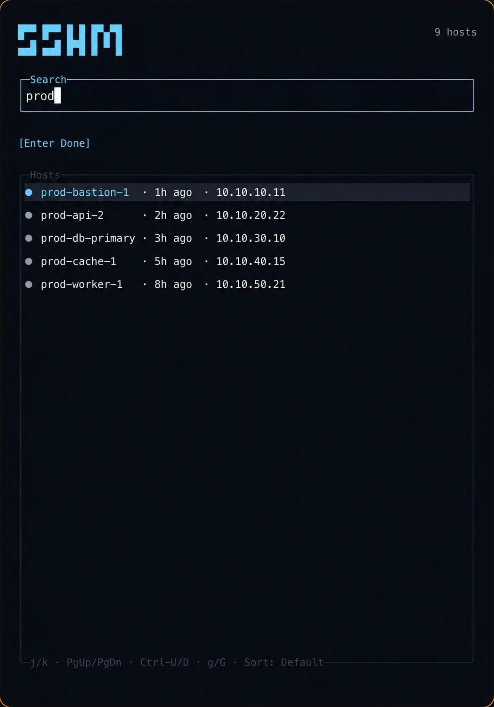
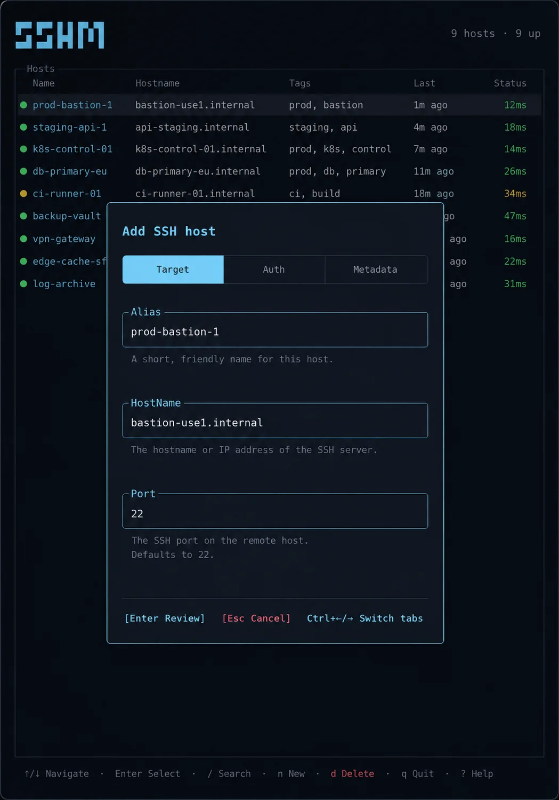
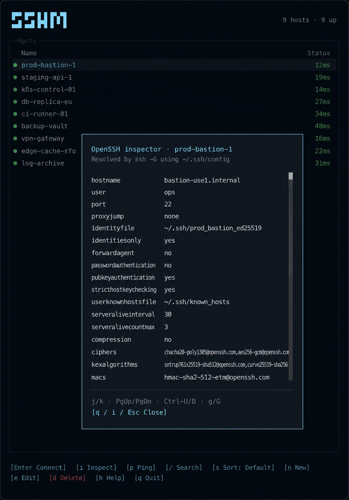

# sshm

`sshm` is a small SSH host manager for people who live in the terminal. It gives your `~/.ssh/config` a keyboard-first UI without taking ownership of SSH: OpenSSH still resolves config, authenticates, connects, and handles forwarding.



## Install

```sh
curl -fsSL https://raw.githubusercontent.com/abhishekbhardwaj/sshm/main/scripts/install.sh | bash
```

The installer puts `sshm` in `~/.local/bin`. Add that directory to your `PATH` if it is not there already.

You can also download an archive from [GitHub Releases](https://github.com/abhishekbhardwaj/sshm/releases), or build it yourself:

```sh
git clone https://github.com/abhishekbhardwaj/sshm.git
cd sshm
bun install
bun run build
./sshm
```

## Use it

Run `sshm` with no arguments to open the TUI. It reads `~/.ssh/config` by default.

```sh
sshm
sshm --config /tmp/sshm-config
```

### Browse and search

Search aliases, hostnames, tags, and notes from the host list, then connect or check reachability without leaving the keyboard.

<p align="center">
  
</p>

### Add, edit, and inspect

Add, edit, or delete a concrete `Host` block, and inspect the effective settings resolved by `ssh -G`. You can also keep tags, notes, favourites, and recent connections. That extra information belongs to sshm, not your SSH config.

<table>
  <tr>
    <td width="50%"></td>
    <td width="50%"></td>
  </tr>
  <tr>
    <td align="center"><strong>Guided host form</strong></td>
    <td align="center"><strong>Effective OpenSSH settings</strong></td>
  </tr>
</table>

Changes to SSH config always show a diff before sshm writes anything. Passwords and key passphrases never go into sshm; OpenSSH asks for them when it needs them.

On startup, sshm checks for an update in the background, reusing the result for one hour. If an update is available, a `u Update` action appears; sshm installs nothing until you open it and confirm.

### Keyboard controls

| Key | Action |
| --- | --- |
| `↑` / `↓`, `j` / `k` | Select a host |
| `PgUp` / `PgDn`, `Ctrl-U` / `Ctrl-D`, `g` / `G` | Move by page, half-page, first, or last |
| `Enter` | Connect |
| `/` | Search aliases, hostnames, tags, and notes |
| `s` | Cycle the temporary sort |
| `i` | Inspect the OpenSSH-resolved settings |
| `p` / `P` | Check the selected host / all hosts |
| `e` | Edit the selected host |
| `o` | Edit its metadata |
| `n` | Add a host |
| `d` | Delete a host |
| `u` | Review an available update |
| `h` | Show help |
| `q` | Quit or close a modal |

Mouse-aware terminals also support selection, double-click to connect, scrolling, and clicking controls.

### Commands for scripts

The command line stays deliberately small. It covers the jobs that make sense outside the UI:

```sh
sshm list [query]
sshm resolve <alias>
sshm connect <alias>
sshm update [--check] # `upgrade` is an alias
sshm uninstall [--purge] [--yes]
sshm add <alias> [hostname] [--port <port>] [--user <user>] [--identity <path>] [--yes]
sshm delete <alias> [--yes]
sshm tag <alias> [tags...]
sshm note <alias> [note...]
sshm favourite <alias> <on|off>
```

`update` uses the curl installer; use `--check` to check GitHub Releases without installing. `uninstall` removes only `~/.local/bin/sshm` unless `--purge` is passed; it always requires `--yes`. Omit tags or a note to clear them. `add` and `delete` print a diff and stop unless you repeat them with `--yes`. Edit complex host blocks in the TUI; the old hostname-only command and incomplete forwarding presets were removed.

Only top-level `Include` directives are discoverable. Move an `Include` nested under `Host` or `Match` to the top level before using sshm.

## Where sshm keeps its data

Tags, notes, favourites, and recent connections are stored separately from SSH configuration. On Linux that is `$XDG_CONFIG_HOME/sshm/config.json`, or `~/.config/sshm/config.json` when `XDG_CONFIG_HOME` is unset.

## Development

```sh
bun install
bun audit
bun run lint
bun run typecheck
bun test
bun run build
./sshm --version
```

Run the OpenSSH end-to-end test suite with `bun run test:e2e`. It needs `sshd` and `ssh-keygen`; the test starts its own server and uses a temporary home directory.

## Releases

Releases follow the same tag-driven flow as [aish-cli](https://github.com/abhishekbhardwaj/aish-cli): the release helper bumps the version, commits it, creates a `vX.Y.Z` tag, and pushes `main` plus that tag. GitHub Actions builds checked standalone archives for Linux x64 (including a baseline build) and ARM64, macOS Intel and Apple Silicon, and Windows x64.

```sh
./scripts/release.sh patch
./scripts/release.sh minor --dry-run
./scripts/release.sh major --no-push
```

For local cross-platform builds, run `bun run release`. Each GitHub Release includes SHA-256 checksum files.
